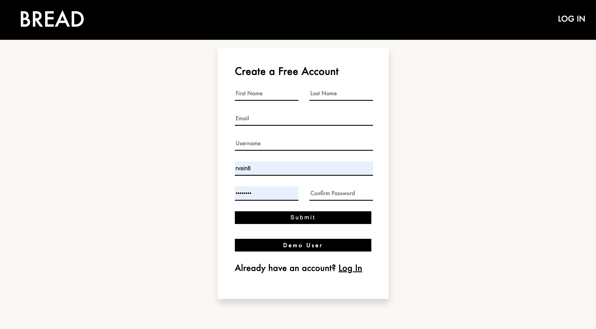
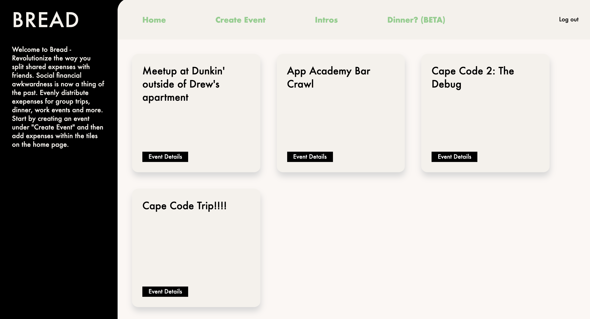

Bread is an organizational tool where users can form events with each-other and log expenses that are to be split up by others in the event.

It is centered around an event created by you or friends, so the app can keep track of expenses throughout the night - so you can enjoy the night!

[Live Link](https://mongo-bread.herokuapp.com/#/)

## Features

A user can register an account.

  

  

A user can create an event and add party members (friends).
  

  

Expenses are logged/added on by the User as the event progresses.

When the event is over, the expense is divided equally through a built-in expenses calculator.

## Code Highlights
### Expense Total
Implemented logic behind adding expenses by event id.

router.get("/:id/total", (req, res) => {
    Expense.find( {event_id : {$in : req.params.id}})
  .then( expense => {

    const total = [];
    expense.forEach(expense => {
      total.unshift(expense.amount)
    })

    // debugger

    sum = 0;
    total.forEach(decimal => {
      sum += JSON.parse(decimal)
    })
    
    res.json(sum);
  })

});

module.exports = router;

## Search Bar
Implemented a search bar so user's can add friends to an event.

import React from 'react';
import './search.css';

class UserSearch extends React.Component {
    constructor(props) {
        super(props);

        this.state = {
            bounds: '',
        };

        this.handleChange = this.handleChange.bind(this);
        this.handleSubmit = this.handleSubmit.bind(this);
    }

    componentWillUnmount() {
      this.props.clearSearch();
    }

    handleSubmit(e) {
        e.preventDefault()
        this.props.fetchUsers(this.state.bounds);
    }

    handleChange(e) {
        this.setState({ bounds: e.target.value });
    }

    render() {
      let results = [];
      let resultsContainer = "";
      if (Object.values(this.props.users).length > 0) {
        Object.values(this.props.users).forEach((user) => {
          if (user._id !== this.props.currentUserId) {
            results.push(
              

                {user.username}
                <i className="fas fa-plus-circle"></i>
              

            );
          }
        });
        if (results.length > 0) {
          resultsContainer = (
            
{results}

          );
        }
      }
      return (
        

          

            <form onSubmit={this.handleSubmit}>
              <input
                name="search"
                type="text"
                value={this.state.bounds}
                onChange={this.handleChange}
                placeholder="Search Usernames"
              />
              <button type="submit">
                <i className="fas fa-search"></i>
              </button>
            </form>
          

          {resultsContainer}
        

      );
    }
}

export default UserSearch;

## Technologies 
* Mongoose(MongoDB)
* Express
* Node.JS
* React / Redux
* CSS / HTML

## Group Members
* Nick Draper
* Drew Shroyer
* JR McCann
* Ravneet Singh

