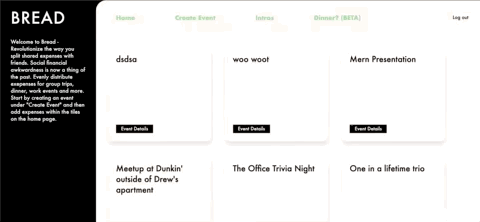

# Introduction - At a glance
### Bread is an organizational tool where users can form events with each-other and log expenses that are to be split up by others in the event. Centered around an event created by you a friend, Bread can keep track of expenses throughout the night - so you can focus on enjoying your time!

<a href="https://mongo-bread.herokuapp.com/#/"><p align="center">Live Link</p></a>
<a href="https://mongo-bread.herokuapp.com/#/"><p align="center"></p></a>
<br><br/>

## Features
- User account creation and authentication
- User can create an event and add party members (friends).
- Expenses are logged/added on by the User as the event progresses.
- When the event is over, the expense is divided equally through a built-in expenses calculator.
- Includes a tip calculator for quick calculation after dinner

## Code Highlights
### Expense Total
Implemented logic behind adding expenses by event id.
```
// routes/expenses.js

router.get("/:id/total", (req, res) => {
    Expense.find( {event_id : {$in : req.params.id}})
  .then( expense => {

    const total = [];
    expense.forEach(expense => {
      total.unshift(expense.amount)
    })

    // debugger

    sum = 0;
    total.forEach(decimal => {
      sum += JSON.parse(decimal)
    })

    res.json(sum);
  })

});

module.exports = router;
```
### Search Bar

<p align="center"></p>

Implemented a search bar so user's can add friends to an event. This was done by creating a search form that would send the search term `bounds` to the backend. We then filtered the results using a regex expression to find usernames that match the parameters of the bounds.
```
// routes/api/searches.js

router.get('/search', (req, res) => {

    if(req.query.bounds) {
        User
            .find({ username: { $regex: `${req.query.bounds}`, $options: "gi" } })
            .then(users => res.json(users))
            .catch(err => res.status(400).json(err));
  
    } else {
        // grab all users from db

        User
            .find()
            .then(users => res.json(users))
            .catch(err => res.status(400).json(err));

    }

});
```
Then, we would send back the filtered users and place them in a specific slice of state under `state.entities.users.search` so that we could specifically manipulate what usernames users see in the search results bar vs other parts of the webapp that might contain user information unrelated to that of the search. For example, you can see this in action in the above gif where added users stay even when the search bounds change. Below is our action that first updates our filter state and then fetches the searched users from the database.
```
// filter_acitons.js
import { fetchUsersFromSearch } from './user_actions';

export const UPDATE_FILTER = 'UPDATE_FILTER';

export const changeFilter = (filter, value) => ({
    type: UPDATE_FILTER,
    filter,
    value
});

export const updateFilter = (filter, value) => (dispatch, getState) => {
    dispatch(changeFilter(filter, value));
    return fetchUsersFromSearch(getState().ui.filters)(dispatch);
};
```

## Technologies 
* Mongoose(MongoDB)
* Express
* Node.JS
* React / Redux
* CSS / HTML

## Group Members
* Nick Draper
  * [GitHub](https://github.com/nickdraper8)
  * [LinkedIn](https://www.linkedin.com/in/nicholas-draper/)
  * [AngelList](https://angel.co/u/nicholas-draper-2)
* Drew Shroyer
* JR McCann
* Ravneet Singh


